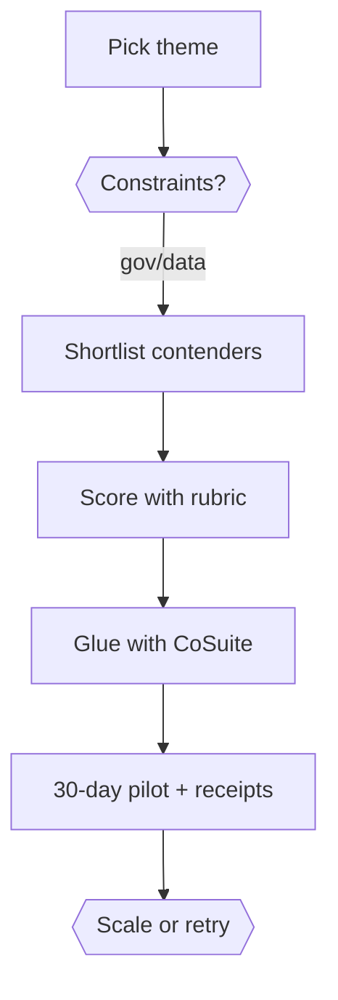

# CoSuite Open-Source Compass

**Tagline:** *Rapidly build team, organization, and regulatory tools that are free, safe, credible, auditable, and immediate—glued together by CoCivium (an open-source community).*

**Version:** 1.5 (2025-10-28 20:00:11 UTC)
**Maintainer:** CoCivium/CoSuite
**Ethos:** *no corruption, no coercion, no crowns*
**License:** All free except where related to CoCivium security/defense (e.g., CC-BY 4.0).

> **Executive summary.** CoSuite helps you ship credible pilots fast using open source—then scale behind evidence. Start with one theme, use our rubric to compare contenders, glue the winners with CoSuite modules, and ship a 30-day pilot with receipts (hashes, URLs, dates) and a safe rollback. Audience: builders, civic/gov innovators, contributors. Promise: faster time-to-demo, lower lock-in, better auditability. Next step: pick a theme, run the BPOE checklist, open a PR.

---

## 0) CoCivium—what it is and why it exists (flyer edition)
**Vision (why):** Help protect a democratic world by enabling hybrid-society (human+AI) tools and systems that are ethical, equitable, and safely guardrailed.

**What CoCivium is:** a public-interest, vendor-neutral community that curates the best open-source practices and components into repeatable operating environments—and glues them with code, checklists, and guardrails.

**What you’ll actually make (first 30 days):**
- **0.1** A working **pilot** you can demo to stakeholders.
- **0.2** A **scorecard** that explains *why* you chose each component.
- **0.3** An **audit pack** (receipts + rollback plan) that makes your choice defensible.

**Day-1 scope:** pick *one* theme, ship one credible pilot, document it. CoSuite expands with you later.
**Mythos note:** *No crowns. Plenty of daylight. Bring your own mind, and your favorite AI.*

---

## 1) What this is (one-page overview)
- **Why open source first** is a robust default for capability, speed, transparency, and sovereignty.
- **How CoSuite curates**: theme → contenders → evidence → recommendation.
- **Where CoSuite leads**: advantages and integration glue across CoSuite repos.
- **How to self-update**: re-score with your constraints and evidence.

> **Disclaimer:** AI-assisted, date-stamped, and meant to be auto-refreshable by your own AI pipeline. Aligned with CoCivium ethos: truthful, auditable, vendor-neutral.

---

## 2) Who it’s for (and why they care)
- Builders (startups, govtech, civic tech, research groups) choosing stacks under uncertainty.
- Decision-makers weighing open-source vs. commercial vs. hybrid.
- Contributors orienting to the CoSuite roadmap.

### 2.1 Personas (why they care)
- **Builder** wants fast demo → proof. *Fears*: lock-in, brittle novelty. *Success*: pilot in 30 days + receipts. **CTA**: adopt the starter theme and open a PR.
- **Civic/Gov innovator** wants auditability and migration path. *Fears*: procurement traps. *Success*: vendor-neutral evidence + rollback. **CTA**: use our rubric + assurance box.
- **Contributor** wants clear lanes. *Fears*: breaking prod. *Success*: safe folder + green CI. **CTA**: create your folder, follow the bootstrap.

---

## 3) Why “Open Source First” (evidence channels)
**3.1 Durability & Auditability** — Code, methods, and data contracts are inspectable; forks exist.
**3.2 Pace** — Community iteration outcompetes single-vendor timelines.
**3.3 Sovereignty** — Reduced lock-in; modular contracts; transparent governance.
**3.4 TCO** — Lower acquisition cost; competitive pressure; fork/replicate options.
**3.5 Talent & Ecosystem** — Standards + public docs accelerate onboarding.
> **3.6 CoSuite’s role:** turn “many good projects” into **BPOEs** with glue code, checklists, governance patterns.

---

## 4) How CoSuite evaluates (methodology)
**4.1 Core dimensions** (0–5 each; weights): Maturity×2, Quality×2, Security×2, Docs×1.5, Ecosystem×1.5, Governance×1, Adoptability×2, TCO×1.

**4.2 Evidence pack:** repo signals, security posture, references, integration friction, migration plan.
**4.3 Outputs:** weighted scorecards + rationale; integration notes; BPOE checklists.

---

## 5) Themes (start narrow, then expand)
| Theme | Best for | Must-have evidence | CoSuite glue |
|---|---|---|---|
| AI/Agents Runtime | Task orchestration w/ guardrails | eval harness, failure taxonomy, rate/abuse controls | CoAgent + CoAudit |
| Search & Retrieval | Hybrid RAG, auditing facts | index freshness, recall/precision, bias checks | CoModules.search + GIBindex |
| Observability & QA | SLOs, traceability | coverage, soak tests, change receipts | CoCore + CoAudit |
| Identity & Reputation | Rights/roles, verifiable claims | revocation, replay resistance | MeritRank/RepTag/ScriptTag |
| Security & Supply Chain | SBOMs, provenance | signed releases, CVE cadence | CoCore + CoAudit |

### 5.1 Filled example: AI/Agents Runtime
| Contender | Maturity×2 | Quality×2 | Security×2 | Docs×1.5 | Ecosystem×1.5 | Governance×1 | Adoptability×2 | TCO×1 | **Total** | Notes |
|---|---:|---:|---:|---:|---:|---:|---:|---:|---:|---|
| **CoAgent (CoSuite)** | 8 | 8 | 8 | 6 | 6 | 5 | 8 | 5 | **54** | Governance container & guardrails; integrates CoAudit/CoCache. |
| OSS Runtime A | 7 | 7 | 6 | 7 | 8 | 4 | 7 | 6 | **52** | Rich ecosystem; needs audit adapters. |
| Commercial Platform B | 9 | 9 | 9 | 8 | 8 | 6 | 7 | 4 | **60** | Great maturity/security; lock-in & cost risks. |

> **Assurance.** **Risks:** mis-routing, prompt injection, rate abuse. **Mitigations:** policy checks, eval gates, limiter. **Exit:** adapter layer + export receipts.

### 5.2 Filled example: Search & Retrieval
| Contender | Maturity×2 | Quality×2 | Security×2 | Docs×1.5 | Ecosystem×1.5 | Governance×1 | Adoptability×2 | TCO×1 | **Total** | Notes |
|---|---:|---:|---:|---:|---:|---:|---:|---:|---:|---|
| **CoModules.search + GIBindex** | 8 | 7 | 7 | 6 | 6 | 5 | 8 | 5 | **52** | Concept-first indexing; auditable pipelines. |
| OSS Engine C | 9 | 8 | 7 | 8 | 8 | 4 | 7 | 5 | **56** | Strong ecosystem; needs audit adapters. |
| Managed Service D | 9 | 9 | 9 | 8 | 9 | 6 | 7 | 4 | **61** | Reliability; lock-in & cost risks. |

> **Assurance.** **Risks:** stale embeddings, ranking bias, service drift. **Mitigations:** freshness SLA, bias probes, adapter parity. **Exit:** re-index walk with receipts.

---

## 6) CoSuite map: repos, tools & helpers
(See manual’s section in earlier drafts for repo roles, AdviceBomb workflow, CoSync trail, and contributor posture.)

---

## 7) Example scorecard template
(see `/docs/marketing/scorecards/SCHEMA.csv` and `/tools/Render-Scorecard.ps1`)

---

## 8) How to reproduce & self-update
1. Fork; 2. Collect signals under `/evidence/<theme>/`; 3. Run scoring; 4. Attach receipts; 5. PR with CI.

---

## 9) Adoption playbook (30-day)
D1–3 constraints; D4–10 sandbox + eval; D11–18 tasks + receipts; D19–24 BPOE checks + SBOM; D25–30 demo + PR.

---

## 10) Competitive positioning
Fair, receipts-backed comparisons; integrate where others win; always publish an exit plan.

---

## 11) Governance & ethos
Public-interest alignment; vendor-neutral container; transparent diffs.

---

## 12) Call to action
Pick one theme → ship a pilot in 30 days; open a PR; contribute receipts; sponsor public-interest work.

**Contributor CoSync:** See docs/New_Session_CoSync_for_Contributors.md for the session bootstrap used by Contributors.
**Fun closer:** *Build boldly. Audit kindly. If it breaks, leave breadcrumbs for your future self.*

